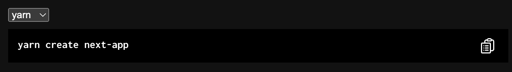

# Packages.run
Make your installaton step shorter



<a href="https://www.packages.run/api/v1?npx=npx create-next-app@latest&yarn=yarn create next-app&pnpm=pnpm create next-app">Demo</a>


## Example
https://nextjs.org/docs/getting-started

Current:
```
npx create-next-app@latest
# or
yarn create next-app
# or
pnpm create next-app
```

Embed: 
```
<iframe style="width: 100%; height: 110px; border: none;" src="https://www.packages.run/api/v1/api/v1?npx=npx%20create-next-app@latest&yarn=yarn%20create%20next-app&pnpm=pnpm%20create%20next-app"></iframe>
```

URL:
```
https://www.packages.run/api/v1/api/v1?npx=npx create-next-app@latest&yarn=yarn create next-app&pnpm=pnpm create next-app
```
